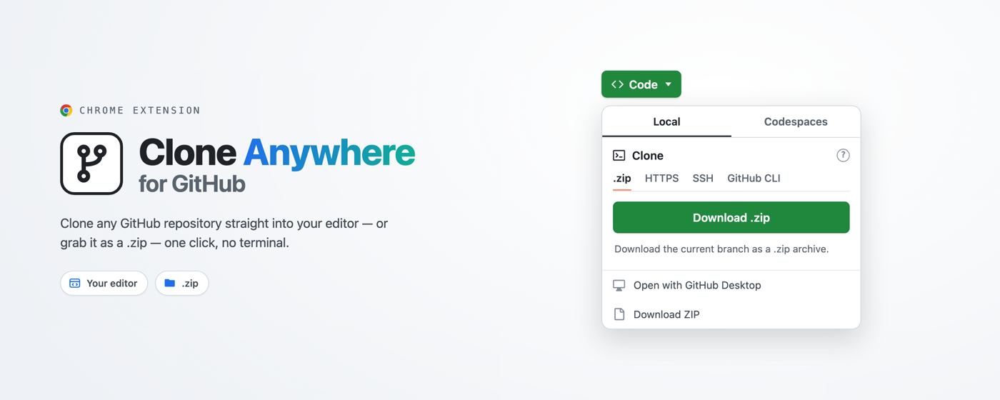

# Clone Anywhere for GitHub 🚀

> Adds a "Clone in …" button to GitHub repository pages that opens any repo in VS Code, Cursor, Windsurf, VSCodium, or VS Code Insiders — or downloads it as a `.zip`. One click, no terminal.

<div align="center">



[](https://chromewebstore.google.com/detail/clone-anywhere-for-github/effhdkonnknoebahhnnciakckbbfmcpi)
[](https://chromewebstore.google.com/detail/clone-anywhere-for-github/effhdkonnknoebahhnnciakckbbfmcpi)
[](https://chromewebstore.google.com/detail/clone-anywhere-for-github/effhdkonnknoebahhnnciakckbbfmcpi)
[](https://github.com/AdamAkhlaq/clone-anywhere-for-github/stargazers)
[](LICENSE)

</div>

## 📦 Install

<div align="center">

[](https://chromewebstore.google.com/detail/clone-anywhere-for-github/effhdkonnknoebahhnnciakckbbfmcpi)

</div>

Available for Chrome, Edge, Brave, Opera, and other Chromium-based browsers. Once installed, open any GitHub repository — there's nothing to configure. Prefer to build it yourself? See [Development](#development).

## ✨ Features

- **One-click clone** — open any repo in your editor straight from its GitHub page.
- **Choose your editor** — VS Code, VS Code Insiders, VSCodium, Cursor, or Windsurf, set from the toolbar popup and remembered.
- **Or download a `.zip`** — grab a source archive of the branch you're viewing, no editor needed.
- **Native integration** — the button matches GitHub's UI and survives its single-page navigation.
- **Private by design** — runs only on github.com, with no tracking or data collection.

## 🚀 How it works

1. Open any GitHub repository and click the green **Code** button.

   

2. Click **"Clone in …"** — the first option, named for your chosen editor — and it opens with the clone dialog ready.

Behind the scenes the extension builds a deep link your editor handles automatically, e.g. `vscode://vscode.git/clone?url=https://github.com/owner/repo.git` (or `cursor://…` / `windsurf://…`).

**Choosing your destination.** Click the toolbar icon to pick where repos open. The VS Code-family editors share the same `…/vscode.git/clone` link and differ only by URL scheme. Choose **`.zip`** instead and the button becomes **"Download .zip"**, fetching GitHub's archive of the current branch (`…/archive/refs/heads/<branch>.zip`, falling back to `…/archive/HEAD.zip` for the default branch).

## 🛠️ Troubleshooting

- **Editor doesn't open?** Make sure it's installed and registered as the handler for its URL scheme (e.g. `vscode://`).
- **Button missing?** Refresh the page, or toggle the extension off and on.

## 🔧 Development

```bash
git clone https://github.com/AdamAkhlaq/clone-anywhere-for-github.git
cd clone-anywhere-for-github
npm install
npm run build      # production build into dist/
npm run dev        # watch mode
npm run package    # build + zip for the Chrome Web Store
```

Requires Node.js 20+ (CI builds on 22). Load the unpacked build from `dist/` via `chrome://extensions` → enable Developer mode → **Load unpacked**.

```text
src/            # TypeScript: content script, popup, and lib/
icons/          # Extension icons
store-assets/   # Store listing assets (see store-assets/README.md)
manifest.json   # Manifest V3; version is stamped from package.json at build
```

Built with TypeScript and Chrome Manifest V3. Firefox support is planned for a future release.

## 🔒 Privacy & permissions

- Runs only on `https://github.com/*` (a content script) — no access to any other site.
- Uses a single permission, `storage`, to remember your chosen editor locally.
- No accounts, no tracking, no analytics, no data collection. See [PRIVACY.md](PRIVACY.md).

## 🤝 Contributing

Issues and pull requests are welcome — see [CONTRIBUTING.md](CONTRIBUTING.md). Found a bug or have an idea? [Open an issue](https://github.com/AdamAkhlaq/clone-anywhere-for-github/issues) or start a [discussion](https://github.com/AdamAkhlaq/clone-anywhere-for-github/discussions).

## 📄 License

MIT — see [LICENSE](LICENSE).

## ❤️ Support

If this saves you time, consider starring the repo, [leaving a review](https://chromewebstore.google.com/detail/clone-anywhere-for-github/effhdkonnknoebahhnnciakckbbfmcpi), or sponsoring development:

[](https://github.com/sponsors/AdamAkhlaq)
[](https://ko-fi.com/adamakhlaq)
[](https://buymeacoffee.com/adamakhlaq)
